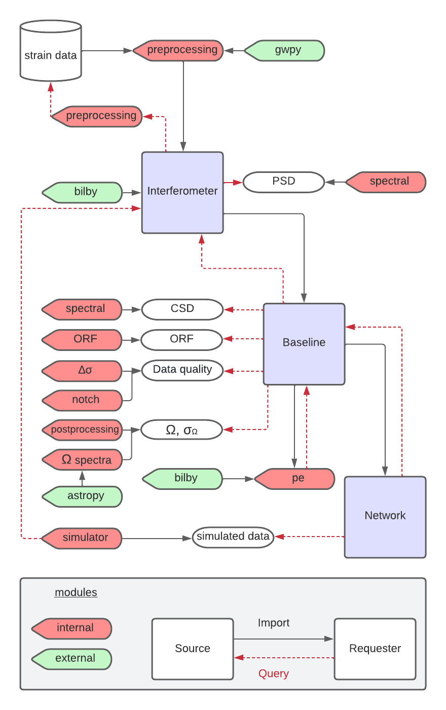

# Summary

# Statement of need

# Method

$$
\hat{\Omega}_{{GW}, f} = \frac{\mathbb{R}\[C_{IJ, f}\]}{\gamma_{IJ}(f) S_0(f)} 
$$

$$
\sigma^2_{{\rm GW,} f} = \frac{1}{2 T \Delta f} \frac{P_{I, f} P_{J, f}}{\gamma^2_{IJ}(f) S^2_0(f)},
$$

Pygwb schema figure \autoref{fig:schema}.
{width=80%}

# Acknowledgements

# References
