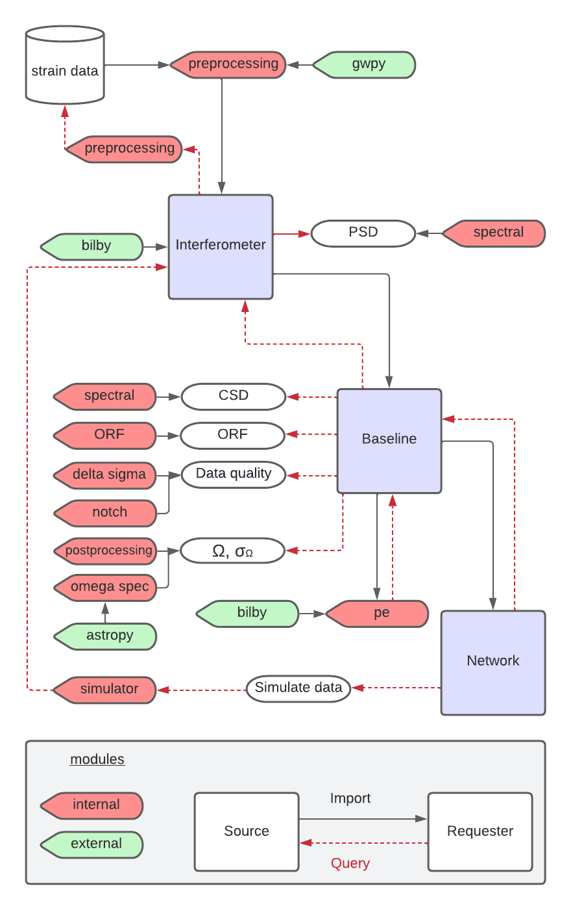

============
API
============

The ``pygwb`` package consists of several modules, each with a distinct functionality. A summary of all ``pygwb`` modules, their interaction with each other, and the main external dependencies can be seen in the schema below.
This API section contains information about each of the modules, as well as a description of all methods therein. The module documentation can be accessed through the table below for each of the modules, or through the table of contents on the left hand side of the page.

.. seealso::

   Additional information about each of the modules can be found in the `pygwb paper <https://arxiv.org/pdf/2303.15696.pdf>`_.

.. currentmodule:: pygwb

.. autosummary::
   :toctree: api
   :template: custom-module-template.rst
   :caption: API:
   :recursive:
   
   detector
   baseline
   network

   preprocessing
   spectral
   coherence
   postprocessing
   omega_spectra
   pe
   statistical_checks

   simulator

   delta_sigma_cut
   notch
   
   constants
   orfs   
   parameters
   util