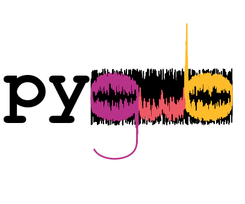

pygwb documentation
===================

.. automodule::
    :members:

`pygwb`: A python-based, user-friendly library for gravitational-wave background (GWB) searches with ground-based interferometers.

`pygwb` provides a modular and flexible codebase to analyse laser interferometer data and design a GWB search pipeline. It is tailored to current ground-based interferometers: LIGO Hanford, LIGO Livingston, and Virgo, but can be generalized to other configurations. It is based on the existing packages `gwpy` and `bilby`, for optimal integration with widely-used GW data anylsis tools.

`pygwb` also includes a set of pre-packaged analysis scripts which may be used to analyse data and perform large-scale searches on a high-performance computing cluster efficiently.

.. raw:: html

   <a href="about.html"><button style="background-color:#307FC1;border-color:#307FC1;color:white;width: 200.0px; height: 100.0px;border-radius: 8px;margin-bottom: 10px;margin-left: 10px">More about pygwb</button></a>
   <a href="installation.html"><button style="background-color:#307FC1;color:white;border-color:#307FC1;width: 200.0px; height: 100.0px;border-radius: 8px;margin-bottom: 10px;margin-left: 10px">Installing pygwb</button></a>
   <a href="tutorials.html"><button style="background-color:#307FC1;color:white;border-color:#307FC1;width: 200.0px; height: 100.0px;border-radius: 8px;margin-bottom: 10px;margin-left: 10px">Tutorials</button></a>
   <a href="demos.html"><button style="background-color:#307FC1;color:white;border-color:#307FC1;width: 200.0px; height: 100.0px;border-radius: 8px;margin-bottom: 10px;margin-left: 10px">Demos</button></a>
   <a href="api.html"><button style="background-color:#307FC1;color:white;border-color:#307FC1;width: 200.0px; height: 100.0px;border-radius: 8px;margin-bottom: 10px;margin-left: 10px">Module API</button></a>
   <a href="contributing.html"><button style="background-color:#307FC1;color:white;border-color:#307FC1;width: 200.0px; height: 100.0px;border-radius: 8px;margin-bottom: 10px;margin-left: 10px">Contributing to pygwb</button></a>
   
.. toctree::
   :maxdepth: 1
   :hidden:

   about
   installation
   tutorials
   demos
   api
   pygwb paper <https://arxiv.org/pdf/2303.15696.pdf>
   citing
   GitHub <https://github.com/a-renzini/pygwb>
   contributing
   Submit an issue <https://github.com/a-renzini/pygwb/issues/new>
